# Go-DDD: Domain Driven Design, SAGA, Event-Sourcing & CQRS

## Немного теории

Современная разработка ПО – это почти всегда про распределенные системы. Микросервисы, облака, глобальный охват – все это стало нормой. Но за красивыми диаграммами и модными словами скрывается фундаментальная сложность. Как заставить кучу разрозненных компонентов работать вместе надежно? Как гарантировать, что данные, размазанные по сети, останутся корректными и доступными? Эта головная боль знакома любому, кто проектировал системы сложнее калькулятора, будь то в требовательном финтехе, динамичном e-commerce или где-либо еще.

И вот тут на помощь (или, скорее, для обозначения поля боя) приходят три понятия: ACID, BASE и теорема CAP. Может показаться, что это сухая теория, но игнорировать их – все равно что выходить в море без компаса и карты. Эти концепции описывают фундаментальные компромиссы, с которыми приходится иметь дело каждому архитектору. Понимание их – не гарантия успеха, но его необходимое условие.

### Незыблемый ACID: Классика жанра (и ее ограничения)

Начнем со столпа, на котором десятилетиями держались базы данных и монолитные приложения. **Что же обещает нам ACID? По сути, это четыре столпа надежности транзакций, фундамент, на котором строилась уверенность в классических системах:**

- **Атомарность (Atomicity):** Все просто – либо вся операция проходит успешно, либо откатывается так, словно ее и не затевали. Представьте перевод денег: списали тут, зачислили там. Нельзя застрять посередине. ACID гарантирует вот это "все или ничего".
- **Согласованность (Consistency):** Тут важно не путать с 'C' из CAP! В ACID это значит, что транзакция не нарушит установленных вами правил игры – всяких там ограничений целостности, уникальности. Баланс не уйдет в минус, если нельзя. Данные остаются логически корректными после каждой транзакции.
- **Изолированность (Isolation):** Мир многопоточный, транзакции летят пачками. Изоляция – это щит, который не дает им наступать друг другу на пятки и видеть промежуточный 'беспорядок' друг друга. В идеале (уровень Serializable) все выглядит так, будто они идут строго по очереди. На деле мы часто идем на компромиссы (используем уровни изоляции попроще) ради скорости, но цель – не дать им смешать карты друг другу.
- **Долговечность (Durability):** Сказано – сделано, и точка. Если база отчиталась об успехе, ваши данные переживут перезагрузку, сбой питания – что угодно, кроме совсем уж апокалипсиса вроде пожара в серверной. Запись надежна.

ACID – это прекрасно. Это как сейф для данных. Но попробуйте растянуть этот сейф на несколько комнат (серверов), соединенных коридорами (сетью). Обеспечить ту же непробиваемость между комнатами становится чертовски сложно. Протоколы вроде двухфазного коммита (2PC), которые пытаются это сделать, требуют координатора и блокировок во всех участвующих "комнатах". Если одна комната задумалась или коридор к ней перекрыли – весь процесс встает. Это бьет по производительности (задержки растут) и, главное, по доступности системы. Цена за строгий распределенный ACID часто оказывается слишком высокой.

**Сложности на нашем пути:**

1. **Физическое разделение данных:** Каждый сервис имеет свою базу (Database per Service). Транзакция, затрагивающая несколько таких баз, не может быть локальной – нужна распределённая транзакция. Стандартные механизмы реляционных СУБД не работают между разными базами через сетевые границы.
2. **Сетевые сбои и задержки:** Межсервисное взаимодействие происходит по сети (REST, gRPC, сообщения). Это вносит непредсказуемые задержки и возможности сбоев связи. Даже если попытаться выполнить связку операций как единую транзакцию, сбой сети или сервиса может привести к тому, что часть операций зафиксирована, а часть – нет.
3. **CAP-теорема и доступность:** В распределённых системах приходится выбирать между строгой согласованностью и доступностью при сбоях связи. Попытка реализовать глобальную ACID-транзакцию (строгая консистентность) зачастую ухудшает доступность: если один из сервисов недоступен или медленно отвечает, общая транзакция блокируется или откатывается. Для высоконагруженных систем это узкое место.
4. **Отсутствие изолированности между сервисами:** В монолите изолированность предотвращает конкурентные конфликты – параллельные транзакции не влияют друг на друга. В микросервисах же, без единого менеджера транзакций, другие сервисы могут увидеть промежуточное состояние данных другого сервиса, поскольку нет общей изоляции.

### Теорема CAP: Жесткая дилемма распределенки

Столкнувшись с проблемами распределенного ACID, индустрия обратилась к теореме CAP. Она стала чем-то вроде закона сохранения энергии для распределенных систем. И нет, это не "выбери два из трех", как часто говорят. Все немного хитрее. Теорема оперирует тремя свойствами:

- Тут **Согласованность (Consistency)** – это про другое, это хардкор. Это когда любое чтение данных откуда угодно выдает самый свежий, только что записанный результат. Как будто источник данных реально один на всех, и все видят его изменения мгновенно.
- **Доступность (Availability)** – значит, система на связи. Вы стучитесь в любой живой узел – он отвечает по существу, а не ошибкой "попробуйте позже". Он может отдать не самые последние данные, но он отвечает.
- **Устойчивость к разделению (Partition Tolerance)** – это способность системы пережить раскол сети, когда узлы теряют связь друг с другом. И вот тут загвоздка, самый важный вывод из CAP: этот раскол сети (P) – не гипотетическая страшилка, а неизбежная реальность любой распределенной системы. Сеть будет "моргать", и с этим надо жить.

И вот что говорит теорема на самом деле: **когда происходит сетевое разделение (P), система должна пожертвовать либо Согласованностью (C), либо Доступностью (A)**. Нельзя иметь и то, и другое **одновременно** в момент разрыва связи.

- **Выбираете CP (Consistency над Availability):** Ваша система превыше всего ценит согласованность данных. Если узел из-за раздела сети не может гарантировать, что видит самую свежую версию данных или что его запись увидят другие, он предпочтет вернуть ошибку или не отвечать вовсе, лишь бы не нарушить линеаризуемость. Вы получаете гарантию C ценой потенциальной недоступности части системы во время P.
- **Выбираете AP (Availability над Consistency):** Ваша система превыше всего ценит возможность ответить пользователю. Даже если узел изолирован разделом, он продолжит обрабатывать запросы (возможно, на основе локальных, потенциально устаревших данных) и принимать новые записи (которые потом придется как-то синхронизировать). Вы получаете гарантию A ценой временной (или даже постоянной, если конфликты не разрешить) рассогласованности данных между частями системы во время P.

А что же системы CA (Consistency + Availability)? Они возможны лишь в гипотетическом мире без сетевых проблем. Как только случается P, любая CA-система вынуждена будет деградировать либо до CP, либо до AP.

### BASE: Прагматизм в мире несовершенства

Итак, если вы столкнулись с реальностью P и выбрали A (доступность), вы естественным образом приходите к принципам, описываемым акронимом BASE. Это не строгий стандарт, а скорее философия проектирования систем, которые оптимизированы для работы в условиях частичных отказов и нестрогой согласованности:

- **Basically Available (Базовая доступность):** Система делает все возможное, чтобы оставаться доступной для запросов, как и предполагает выбор 'A' в CAP. Может быть, не все функции работают идеально, но система "жива".
- **Soft state (Гибкое состояние):** Состояние системы может меняться со временем даже без прямого внешнего воздействия. Это происходит из-за фоновых процессов синхронизации, когда узлы обмениваются информацией и пытаются прийти к единому состоянию. Представьте кэши, которые периодически инвалидируются или обновляются.
- **Eventually consistent (Согласованность в конечном счете):** Самый известный и часто неправильно понимаемый принцип BASE. Система не гарантирует, что сразу после записи все узлы увидят новое значение. Но она гарантирует, что если новых записей в этот конкретный фрагмент данных больше не поступает, то рано или поздно все реплики этого фрагмента сойдутся к последнему записанному значению. "Рано или поздно" – ключевой момент, который может означать миллисекунды, секунды или даже минуты, и это время должно быть как-то ограничено или хотя бы наблюдаемо.

BASE – это признание того, что во многих случаях абсолютная немедленная согласованность не нужна и ее достижение слишком дорого обходится с точки зрения доступности и производительности. Лента новостей, рекомендации товаров, количество просмотров – здесь задержка в синхронизации часто приемлема. Это оптимистичный подход: принимаем изменения, а потом разбираемся. Но важно помнить: работать с eventually consistent данными сложнее, нужно учитывать возможные аномалии чтения (прочитать старые данные после новых, например).

### Архитектура как искусство компромисса: Применяем ACID/BASE/CAP

Понимание этих трех концепций – это только начало. Настоящая работа архитектора – применять их для принятия конкретных решений:

1. **Требования – во главе угла:** Всегда начинайте с вопроса "Что нужно бизнесу и пользователю?". Насколько критична потеря или рассогласованность этих конкретных данных? Какова цена ошибки? Каковы ожидания по времени отклика? Ответы на эти вопросы помогут определить, нужна ли вам крепость ACID или гибкость BASE для данной части системы. И умение перевести технические ограничения CAP на язык бизнес-рисков – важный навык архитектора.
2. **Выбор технологий:** Решение о СУБД, брокере сообщений, кэше – это во многом решение о модели согласованности/доступности.
   - **Реляционные СУБД (Postgres, etc.):** Обычно ваш выбор для данных, требующих строгого ACID. В кластере часто ориентированы на CP.
   - **NoSQL:** Здесь царит разнообразие. Cassandra и Riak славятся своей AP-ориентацией. MongoDB и Couchbase предлагают гибкую настройку согласованности. Key-value хранилища типа Redis часто используют для кэширования (AP). Важно читать документацию и понимать настройки – одна и та же СУБД может вести себя по-разному. Например, настройка кворумов чтения/записи в Cassandra напрямую влияет на баланс C и A.
3. **Архитектурные паттерны:** Многие популярные паттерны – это, по сути, способы обойти ограничения или реализовать нужную модель поведения:
   - **Saga:** Позволяет оркестрировать сложные бизнес-операции, разбивая их на локальные ACID-транзакции с компенсациями. Это способ достичь бизнес-атомарности там, где распределенный ACID (2PC) непрактичен из-за влияния на доступность.
   - **CQRS:** Разделение путей для команд (запись) и запросов (чтение). Позволяет иметь более строгую модель для записи и оптимизированную, возможно, eventually consistent модель для чтения. Это прямой ответ на то, что требования к согласованности для записи и чтения часто различаются.
   - **Event Sourcing:** Запись истории изменений как событий. Отлично ложится на CQRS и облегчает построение eventually consistent проекций, а также анализ и отладку.
   - **Очереди сообщений (Kafka, RabbitMQ):** Сердце асинхронной, слабосвязанной архитектуры (AP/BASE). Позволяют сервисам общаться надежно, но без прямых блокирующих вызовов, сглаживая пики нагрузки и обеспечивая механизм для eventual consistency. Важно также думать об идемпотентности обработчиков сообщений.
4. **Жизнь с Partition Tolerance:** Нужно не только выбрать CP/AP, но и спроектировать систему так, чтобы она могла пережить P. Это включает:
   - Надежный мониторинг состояния узлов и сети.
   - Стратегии разрешения конфликтов для AP-систем (кто побеждает при одновременной записи?).
   - Мониторинг задержек репликации в BASE-системах, чтобы понимать, насколько "старыми" могут быть данные.
   - Четкие алерты при обнаружении разделов сети или аномально больших задержек.

### Осознанный выбор

**ACID, BASE и CAP** – это не догмы, а инструменты мышления. Они подсвечивают неизбежные компромиссы в сложном мире распределенных систем. Нет "серебряной пули". Так что работа архитектора – это постоянный поиск баланса. Идеальных решений тут нет, есть только выбор наиболее подходящего размена для конкретной задачи, с учетом всех "хотелок" бизнеса, технических реалий и того, что нужно пользователю в данный момент. Это всегда компромисс, и наша задача – сделать его осознанным и управляемым.

## Эволюция архитектуры распределенных систем

## Введение

Все, кто занимается разработкой микросервисов, так или иначе решают для себя вопрос: как обеспечить согласованность бизнес-транзакций, в которых участвуют данные нескольких сервисов. Разумеется, лучшее решение - отсутствие такой необходимости. Но не всегда это возможно.

Переход от монолита к микросервисной архитектуре приносит гибкость и масштабируемость, но и создает новые сложности. Одна из ключевых проблем – согласованность данных и транзакции. В монолите обычно можно обернуть несколько операций одной ACID-транзакцией: либо все операции выполняются успешно, либо при ошибке происходит полный откат. В мире микросервисов такой прямолинейный подход не работает. Каждый сервис автономен, у каждого своя база данных, и общаются они через сеть. Как результат, гарантировать атомарность и целостность процессов, охватывающих несколько сервисов, непросто. Возникает риск частичных обновлений: одна часть системы изменилась, а другая – нет, что приводит к неконсистентным (несогласованным) состояниям данных.

В этом документе мы проследим эволюцию архитектурных подходов:

1. Базовая реализация SAGA
2. Улучшенная Event-Driven SAGA
3. Переход к CQRS
4. Введение Event Sourcing
5. Комбинированный подход ES+CQRS

## Введение в проблематику

Распределенные транзакции в микросервисной архитектуре требуют особых подходов. 
Рассмотрим эволюцию решения от базовой SAGA до комплексной Event-Driven архитектуры.

## SAGA

### Проблематика

Saga – это паттерн, позволяющий достичь целостности данных в распределённых системах без использования глобальных ACID-транзакций. Идея состоит в том, чтобы разбить большую бизнес-транзакцию, затрагивающую несколько сервисов, на последовательность локальных транзакций в каждом из сервисов. Каждый шаг выполняется в рамках своего сервиса атомарно. Если все шаги прошли успешно – вся сага считается успешной. Если же на каком-то этапе произошла ошибка, паттерн Saga предусматривает выполнение компенсирующих транзакций для отмены уже выполненных действий и возврата системы в согласованное состояние.

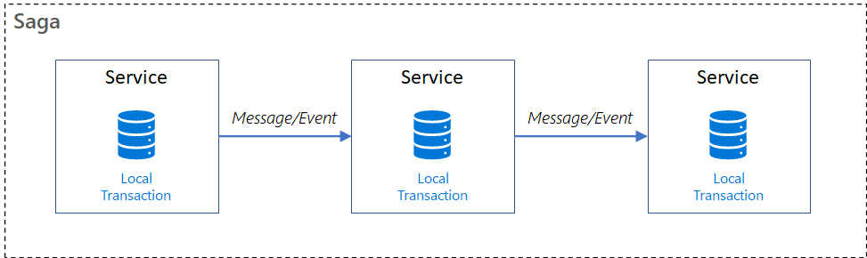

**Каждая локальная транзакция:**

1. Выполняет свою работу атомарно в рамках одной службы.
2. Обновляет базу данных службы.
3. Инициирует следующую транзакцию через событие или сообщение.

Если локальная транзакция завершается ошибкой, сага выполняет ряд **компенсирующих транзакций**, чтобы отменить изменения, внесенные предыдущими локальными транзакциями.

### Основные понятия

Как работает Saga: Транзакции с "откатом"
Представьте, что вы бронируете путешествие через приложение. Это включает несколько шагов:

1. Забронировать отель
2. Купить билеты на самолет
3. Оплатить страховку

> **Компенсируемые транзакции (Compensable Transactions)** могут быть отменены или компенсируются другими транзакциями с противоположным эффектом. Если шаг сага завершается ошибкой, компенсирующие транзакции отменяют изменения, внесенные компенсируемыми транзакциями.
>
> Код:
> ```go
> package main
> 
> func cancelHotelBooking(bookingID string) error {
>    // Возвращаем деньги и освобождаем номер
>    return hotelAPI.Cancel(bookingID)
> }
> ```

> **Точка невозврата (Pivot Transaction)**
> - Последний шаг, после которого отмена невозможна
> - Пример: Выдача электронных билетов на самолет
> - Важно: Все шаги ДО этой точки должны быть компенсируемыми

> Повторяемые транзакции (Retriable Transactions)
> - Идемпотентные операции после точки невозврата
> - Пример: Отправка билетов на почту (можно повторить)
> 
> Код:
> ```go
> package main
> 
> func sendTickets(email string, tickets []Ticket) error {
>    // Отправка с проверкой "не отправлено ли уже?"
>    if !checkIfSent(email) {
>        return emailService.Send(email, tickets)
>    }
>    return nil
> }
> ```

**Пример потока Saga для бронирования путешествия:**


1. **Компенсируемые шаги:** Бронь отеля (можно отменить), Покупка билетов (можно вернуть)
2. **Точка невозврата:** Оплата страховки (не возвращается по условиям)
3. **Повторяемые шаги:** Отправка документов (можно отправить повторно)

### Подходы к реализации Saga

Два типичных подхода к реализации сага являются **хореографии** и **оркестрации**. Каждый подход имеет собственный набор проблем и технологий для координации рабочего процесса.

####  Хореография

В подходе к хореографии службы обмениваются событиями без централизованного контроллера. При использовании хореографии каждая локальная транзакция публикует события домена, которые активируют локальные транзакции в других службах.

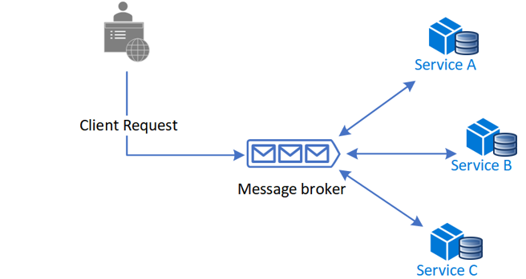

**Пример кода:**

```go
package main

// Сервис заказов (публикует события)
type OrderService struct {
    eventBus EventBus
}

func (s *OrderService) CreateOrder(order Order) error {
    if err := validateOrder(order); err != nil {
        return err
    }

    // Сохраняем заказ в БД
    orderID, err := s.saveOrder(order)
    if err != nil {
        return err
    }

    // Публикуем событие
    s.eventBus.Publish("order.created", OrderCreatedEvent{
        OrderID:    orderID,
        Items:      order.Items,
        CustomerID: order.CustomerID,
        Amount:     order.Amount,
    })
    
    return nil
}

// Сервис оплаты (подписывается на события)
type PaymentService struct {
    eventBus EventBus
}

func (s *PaymentService) Start() {
    s.eventBus.Subscribe("order.created", func(event OrderCreatedEvent) {
        paymentID, err := s.charge(event.CustomerID, event.Amount)
        if err != nil {
            s.eventBus.Publish("payment.failed", PaymentFailedEvent{
                OrderID: event.OrderID,
                Reason:  err.Error(),
            })
            return
        }
        
        s.eventBus.Publish("payment.success", PaymentSuccessEvent{
            OrderID:   event.OrderID,
            PaymentID: paymentID,
        })
    })

    // Подписка на компенсирующие события
    s.eventBus.Subscribe("inventory.reservation_failed", func(event ReservationFailedEvent) {
        s.refund(event.PaymentID)
    })
}

// Сервис инвентаризации
type InventoryService struct {
    eventBus EventBus
}

func (s *InventoryService) Start() {
    s.eventBus.Subscribe("payment.success", func(event PaymentSuccessEvent) {
        err := s.reserveItems(event.OrderID)
        if err != nil {
            s.eventBus.Publish("inventory.reservation_failed", ReservationFailedEvent{
                OrderID:   event.OrderID,
                PaymentID: event.PaymentID,
                Reason:    err.Error(),
            })
            return
        }
        
        s.eventBus.Publish("inventory.reserved", InventoryReservedEvent{
            OrderID: event.OrderID,
        })
    })
}
```

| Преимущества хореографии                                                                 | Недостатки хореографии                                                                 |
|-----------------------------------------------------------------------------------------|----------------------------------------------------------------------------------------|
| **✅ Простота в простых сценариях**<br>Идеально для workflows с 2-3 сервисами без сложной логики координации.<br>Пример: Оформление заказа → Списание → Доставка | **❌ Сложность масштабирования**<br>Добавление новых шагов делает workflow запутанным.<br>Пример: При добавлении сервиса уведомлений нужно модифицировать все связанные сервисы |
| **🔄 Отсутствие централизации**<br>Не требует отдельного сервиса-оркестратора.<br>Пример: Сервис оплаты напрямую вызывает сервис доставки после успешной транзакции | **🔄 Циклические зависимости**<br>Сервисы становятся сильно связанными.<br>Пример: Сервис A вызывает B, B вызывает C, а C снова вызывает A |
| **⚡ Устойчивость к отказам**<br>Нет единой точки отказа.<br>Пример: Если сервис логирования упал, это не влияет на основной workflow | **🐛 Сложность тестирования**<br>Требуется поднимать все сервисы для энд-ту-энд тестов.<br>Пример: Для теста цепочки из 5 сервисов нужны все 5 в рабочем состоянии |
| **📊 Гибкость изменений**<br>Отдельные сервисы могут менять свою логику независимо.<br>Пример: Сервис доставки может обновиться без модификации сервиса оплаты | **🔍 Проблемы отладки**<br>Трудно отследить полный путь выполнения.<br>Пример: При ошибке нужно проверять логи всех сервисов в цепочке |

**Ключевые выводы:**

- Выбирайте хореографию для:
- Простых процессов (≤3 сервисов)
- Когда важна независимость сервисов
- В высоконагруженных системах

**Избегайте хореографии при:**

- Сложных бизнес-процессах
- Частых изменениях workflow
- Жестких требованиях к аудиту

#### Оркестровка

В оркестрации централизованный контроллер или оркестратор, обрабатывает все транзакции и сообщает участникам, какие операции выполнять на основе событий. Оркестратор выполняет запросы saga, хранит и интерпретирует состояния каждой задачи и обрабатывает восстановление сбоев с помощью компенсирующих транзакций.

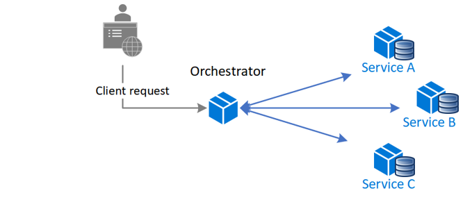

**Пример кода (с центральным координатором):**

```go
package main

// OrderOrchestrator управляет всем процессом оформления заказа
type OrderOrchestrator struct {
    paymentService   *PaymentService
    inventoryService *InventoryService
    shippingService *ShippingService
}

// ProcessOrder выполняет всю цепочку шагов
func (o *OrderOrchestrator) ProcessOrder(order Order) error {
    // Шаг 1: Резервирование товаров
    if err := o.inventoryService.ReserveItems(order.Items); err != nil {
        return fmt.Errorf("reservation failed: %w", err)
    }

    // Шаг 2: Обработка платежа
    paymentID, err := o.paymentService.Charge(order.CustomerID, order.Amount)
    if err != nil {
        // Компенсация: Отмена резерва
        if rollbackErr := o.inventoryService.CancelReservation(order.Items); rollbackErr != nil {
            return fmt.Errorf("payment failed AND rollback failed: %v (original: %w)", rollbackErr, err)
        }
        return fmt.Errorf("payment failed: %w", err)
    }

    // Шаг 3: Организация доставки
    if err := o.shippingService.ScheduleDelivery(order); err != nil {
        // Компенсация: Возврат платежа + отмена резерва
        _, refundErr := o.paymentService.Refund(paymentID)
        rollbackErr := o.inventoryService.CancelReservation(order.Items)
        
        if refundErr != nil || rollbackErr != nil {
            return fmt.Errorf("shipping failed AND rollback problems (refund: %v, inventory: %v) (original: %w)", 
                refundErr, rollbackErr, err)
        }
        return fmt.Errorf("shipping failed: %w", err)
    }

    return nil
}
```

| Преимущества оркестрации                                                                 | Недостатки оркестрации                                                                 |
|-----------------------------------------------------------------------------------------|----------------------------------------------------------------------------------------|
| **🧠 Контроль сложных процессов**<br>Идеально для длинных цепочек из 5+ сервисов.<br>*Пример: Бронирование путешествия (отель + авиа + страховка + экскурсии)* | **🛠 Сложность реализации**<br>Требуется отдельный сервис с координационной логикой.<br>*Пример: Написание оркестратора для e-commerce на 10+ шагов* |
| **🔄 Нет циклических зависимостей**<br>Сервисы общаются только с оркестратором.<br>*Пример: Платежный сервис не знает о сервисе доставки* | **⚠ Единая точка отказа**<br>Падение оркестратора останавливает все процессы.<br>*Пример: При сбое в оркестраторе заказы не обрабатываются* |
| **📝 Четкое разделение ответственности**<br>Бизнес-логика сосредоточена в одном месте.<br>*Пример: Все правила отмены заказа в оркестраторе* | **📉 Производительность**<br>Дополнительное звено в цепочке вызовов.<br>*Пример: Задержки при обработке 1000+ параллельных заказов* |
| **🐞 Простота отладки**<br>Весь workflow виден в одном сервисе.<br>*Пример: Логи оркестратора показывают полный путь заказа* | **🔧 Высокая связанность**<br>Изменения workflow требуют модификации оркестратора.<br>*Пример: Добавление нового шага проверки возраста* |

**Когда выбирать оркестрацию:**

- Для комплексных бизнес-процессов (>4 шагов)
- Когда нужен единый источник истины о состоянии процесса
- В системах с жесткими требованиями к аудиту

#### Оркестрация vs хореография саги. Ключевые отличия:

**Оркестрация:**

Управляет специальный центральный компонент – оркестратор саги. Оркестратор знает сценарий целиком и по шагам рассылает команды сервисам: что делать дальше. Он вызывает Service A, затем Service B, и т.д., и в случае ошибки также инициирует компенсирующие действия. Оркестратор упрощает понимание последовательности (вся логика сосредоточена в одном месте), но вводит дополнительный компонент и точку контроля.

- Централизованное управление процессом
- Явная последовательность шагов
- Проще отслеживать статус

**Пример использования:** Бронирование комплексных туров

**Хореография:**

Здесь нет центрального руководителя – каждый сервис сам реагирует на события и решает, что делать дальше. То есть взаимодействие основано на обмене сообщениями: выполнение шага одним сервисом генерирует событие, которое подхватывают другие сервисы, запускающие свои шаги. Например, Order Service публикует событие OrderCreated; Payment Service, получив его, выполняет платеж и публикует либо PaymentApproved, либо PaymentFailed; Order Service слушает эти события и решает подтверждать или отменять заказ. Хореография исключает центральный координатор – система распределённая и более гибкая, но последовательность действий “размазана” по сервисам, что усложняет сопровождение и отладку.

- Сервисы общаются через события
- Нет единой точки отказа
- Выше гибкость, но сложнее отладка

**Пример использования:** Система обработки заказов e-commerce

Оба подхода широко используются. В простых системах часто хватает хореографии (реактивный подход), но для сложных процессов с множеством условий может быть удобнее оркестрация (явное прописывание сценария).

### Преимущества паттерна Saga

Паттерн Saga стал популярным решением для согласованности данных между микросервисами благодаря нескольким сильным сторонам:

- **Отсутствие глобальных блокировок и распределённых ACID:** Сага позволяет обойтись без двухфазного коммита и других тяжёлых механизмов. Каждый сервис работает в пределах своей транзакции, что упрощает масштабирование. Данные между сервисами синхронизируются через события/команды, а не через общий транзакционный менеджер.
- **Устойчивость к частичным сбоям:** Если один из сервисов в процессе недоступен или операция не удалась, Saga может компенсировать уже выполненные действия. Система возвращается в консистентное состояние без ручного вмешательства. Это повышает отказоустойчивость (каждый локальный шаг откатывается независимо).
- **Гибкость бизнес-логики:** Компенсационные действия не обязательно должны быть точной обратной операцией – это могут быть любые меры, удовлетворяющие бизнес-требованиям для восстановления целостности. Например, если отменить платёж нельзя автоматически, можно пометить заказ как требующий ручного вмешательства. Такая бизнес-ориентированная обработка ошибок невозможна при механическом ACID-откате.
- **Масштабируемость и производительность:** Сервисы взаимодействуют асинхронно (особенно при хореографии), что позволяет им работать параллельно и не ждать друг друга, если логика позволяет. Нет удержания глобальных блокировок – повышается пропускная способность системы. В больших распределённых системах Saga масштабируется лучше, чем централизованный транзакционный координатор.

### Сложности и подводные камни Saga

Несмотря на плюсы, реализация Saga приводит к ряду сложностей, о которых архитекторам и разработчикам нужно помнить:

- **Сложность программирования и компенсирующая логика:** Разработчики должны явно продумывать и кодировать компенсирующие транзакции для каждого шага. Это добавляет работы и требует глубоко понять бизнес-процесс: что делать, если шаг X уже выполнен, а шаг Y провалился? Проектирование таких компенсаций порой непросто (например, «отменить платеж» – нетривиальная задача, если деньги уже списаны).
- **Идемпотентность операций:** Критически важно, чтобы и основные шаги, и компенсации были идемпотентны, то есть повторный запуск операции не изменял состояние сверх первого эффекта. Причина – в распределённой среде неизбежны ретраи и дублирующиеся сообщения. Например, сервис может случайно дважды получить событие или повторно выполнить компенсацию после сбоя. Если компенсационное действие (например, отмена заказа) вызвать дважды, на выходе система должна остаться в корректном состоянии (второй вызов не должен неожиданно что-то испортить). Для этого часто приходится проверять текущее состояние перед действием: если операция уже выполнена ранее, повторно не делать. Идемпотентность усложняет код, но без неё Saga ненадёжна.
- **Промежуточная неполная согласованность:** Пока сага не закончена (или не откатилась при ошибке), система может быть в состоянии, когда часть сервисов уже применили изменения, а другие – ещё нет. Это состояние Eventually Consistent – «в конечном счёте согласованное». Нужно учитывать в бизнес-логике, что между шагами саги данные временно несогласованы. Например, заказ может быть создан, но оплата ещё не проведена – другим сервисам нельзя считать его окончательно оформленным. Обычно решают через статусы (pending, in progress, etc.) и скрытие «полупроведённых» операций от конечных пользователей, пока сага не завершится.
- **Отладка и мониторинг:** Разобраться, что происходит в распределённой саге, сложнее, чем в локальной транзакции. Логика разбросана по сервисам (особенно при хореографии), последовательность действий не видна в одном месте. Необходимо внедрять корреляцию (например, уникальный идентификатор саги, передаваемый во все сообщения), вести детализированные логи, использовать распределённые трейсинг-системы. Только так можно отследить цепочку действий и выявить, где произошла ошибка.
- **Долговечность состояния саги:** Если используется оркестратор, важно хранить прогресс саги в надёжном хранилище. В случае сбоя оркестратора он должен восстановиться и продолжить сагу (или откатить её). Это требует дополнительной работы – например, сохранять статус каждого шага в БД оркестрации. При хореографии долговечность обеспечивается брокером сообщений (сообщения не теряются) и идемпотентностью обработчиков.
- **Не подходит для коротких строго консистентных операций:** Saga хороша для бизнес-процессов, где допустима некоторое время отложенная консистентность. Если же нужна мгновенная атомарность (например, перевод денег между счетами с точностью до копеек), сага может быть избыточной или рискованной – лучше поискать другие методы (об этом далее).

## Двухфазный коммит (Two-Phase Commit, 2PC)

В противоположность Saga, которая полагается на компенсируемую последовательность, протокол **двухфазного коммита (2PC)** стремится сохранить семантику единой атомарной транзакции даже в распределённой системе. 2PC – это классический алгоритм координации транзакции между несколькими узлами (базами данных, сервисами) с помощью централизованного координатора. Его цель – добиться, чтобы все участники либо зафиксировали изменения, либо отменили, и ни один не остался “в стороне”.

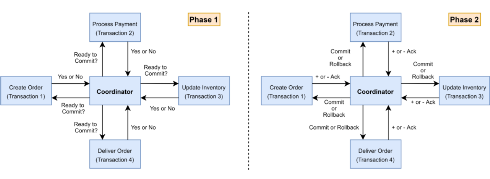

### Принцип работы 2PC

Как следует из названия, протокол выполняется в **две фазы**. Предположим, у нас есть несколько участников (например, два разных сервиса или две базы данных), которые должны выполнить атомарно серию операций. Для координации назначается специальный компонент – **координатор транзакции**. Алгоритм такой:

1. **Фаза подготовки (prepare phase, фаза голосования):** Координатор рассылает всем участникам запрос на подготовку к коммиту. Каждый участник локально выполняет свою часть работы транзакции (например, делает необходимые изменения в своей БД) но не фиксирует их, а помечает как “готовые к коммиту” (в базах данных это обычно означает записать изменения в журнал и заблокировать ресурсы). После этого участник отвечает координатору либо “готов” (Yes), если его этап прошёл успешно и он готов зафиксировать, либо “не могу” (No), если произошла ошибка и он не сможет закоммитить. Все участники по сути голосуют “за” или “против” общей фиксации.
2. **Фаза фиксации (commit phase):** Координатор собирает ответы. Если все участники ответили "готов/Yes", то координатор посылает команду Commit всем участникам. Каждый участник получает эту команду и выполняет фиксацию своих изменений (окончательно применяет их в своей системе). Если хотя бы один участник ответил отказом ("No"), либо не ответил из-за сбоя, координатор посылает команду Rollback всем тем, кто был готов. В результате все участники отменят свои изменения (или не будут фиксировать). Таким образом, достигается атомарность: либо все commit, либо все rollback.

После завершения второй фазы координатор может сообщить инициатору (например, приложению, начавшему транзакцию), что транзакция успешно выполнена или откатилась.

**Пример на псевдокоде:** Ниже показана упрощённая реализация координатора и участников 2PC для двух условных ресурсов:

```go
package main

import (
	"errors"
	"fmt"
	"sync"
)

// TransactionCoordinator управляет двухфазным коммитом
type TransactionCoordinator struct {
	participants []Participant
	mu           sync.Mutex
}

// AddParticipant добавляет участника транзакции
func (tc *TransactionCoordinator) AddParticipant(p Participant) {
	tc.mu.Lock()
	defer tc.mu.Unlock()
	tc.participants = append(tc.participants, p)
}

// PrepareAll фаза подготовки (фаза 1)
func (tc *TransactionCoordinator) PrepareAll() (bool, error) {
	tc.mu.Lock()
	defer tc.mu.Unlock()

	var wg sync.WaitGroup
	results := make(chan error, len(tc.participants))

	for _, p := range tc.participants {
		wg.Add(1)
		go func(p Participant) {
			defer wg.Done()
			if err := p.Prepare(); err != nil {
				results <- fmt.Errorf("%s: %v", p.Name(), err)
				return
			}
			results <- nil
		}(p)
	}

	go func() {
		wg.Wait()
		close(results)
	}()

	var hasErrors bool
	for err := range results {
		if err != nil {
			fmt.Printf("Prepare error: %v\n", err)
			hasErrors = true
		}
	}

	return !hasErrors, nil
}

// CommitAll фаза коммита (фаза 2)
func (tc *TransactionCoordinator) CommitAll() error {
	tc.mu.Lock()
	defer tc.mu.Unlock()

	var wg sync.WaitGroup
	errChan := make(chan error, len(tc.participants))

	for _, p := range tc.participants {
		wg.Add(1)
		go func(p Participant) {
			defer wg.Done()
			if err := p.Commit(); err != nil {
				errChan <- fmt.Errorf("%s commit failed: %v", p.Name(), err)
				return
			}
			errChan <- nil
		}(p)
	}

	go func() {
		wg.Wait()
		close(errChan)
	}()

	for err := range errChan {
		if err != nil {
			return fmt.Errorf("commit failed: %v", err)
		}
	}

	return nil
}

// RollbackAll откат транзакции
func (tc *TransactionCoordinator) RollbackAll() error {
	tc.mu.Lock()
	defer tc.mu.Unlock()

	var wg sync.WaitGroup
	errChan := make(chan error, len(tc.participants))

	for _, p := range tc.participants {
		wg.Add(1)
		go func(p Participant) {
			defer wg.Done()
			if err := p.Rollback(); err != nil {
				errChan <- fmt.Errorf("%s rollback failed: %v", p.Name(), err)
				return
			}
			errChan <- nil
		}(p)
	}

	go func() {
		wg.Wait()
		close(errChan)
	}()

	for err := range errChan {
		if err != nil {
			return fmt.Errorf("rollback failed: %v", err)
		}
	}

	return nil
}

// Participant интерфейс участника транзакции
type Participant interface {
	Name() string
	Prepare() error
	Commit() error
	Rollback() error
}

// DatabaseParticipant реализация участника (БД)
type DatabaseParticipant struct {
	name     string
	prepared bool
}

func NewDatabaseParticipant(name string) *DatabaseParticipant {
	return &DatabaseParticipant{name: name}
}

func (d *DatabaseParticipant) Name() string {
	return d.name
}

func (d *DatabaseParticipant) Prepare() error {
	fmt.Printf("%s: preparing transaction...\n", d.name)
	// Здесь реальная логика подготовки:
	// - блокировка ресурсов
	// - запись в журнал транзакций
	// - проверка возможности выполнения
	
	// Для примера будем считать, что подготовка всегда успешна
	d.prepared = true
	return nil
}

func (d *DatabaseParticipant) Commit() error {
	if !d.prepared {
		return errors.New("not prepared")
	}
	fmt.Printf("%s: committing transaction\n", d.name)
	// Реальная логика коммита
	d.prepared = false
	return nil
}

func (d *DatabaseParticipant) Rollback() error {
	fmt.Printf("%s: rolling back transaction\n", d.name)
	// Реальная логика отката
	d.prepared = false
	return nil
}

func main() {
	coord := TransactionCoordinator{}
	coord.AddParticipant(NewDatabaseParticipant("Database1"))
	coord.AddParticipant(NewDatabaseParticipant("Database2"))
	coord.AddParticipant(NewDatabaseParticipant("PaymentService"))

	// Фаза 1: Подготовка
	ready, err := coord.PrepareAll()
	if err != nil {
		fmt.Printf("Prepare error: %v\n", err)
		return
	}

	if ready {
		// Фаза 2: Коммит
		if err := coord.CommitAll(); err != nil {
			fmt.Printf("Commit failed: %v\n", err)
			// В реальной системе здесь должна быть дополнительная обработка
		} else {
			fmt.Println("Transaction committed successfully")
		}
	} else {
		// Откат
		if err := coord.RollbackAll(); err != nil {
			fmt.Printf("Rollback failed: %v\n", err)
		} else {
			fmt.Println("Transaction rolled back")
		}
	}
}
```

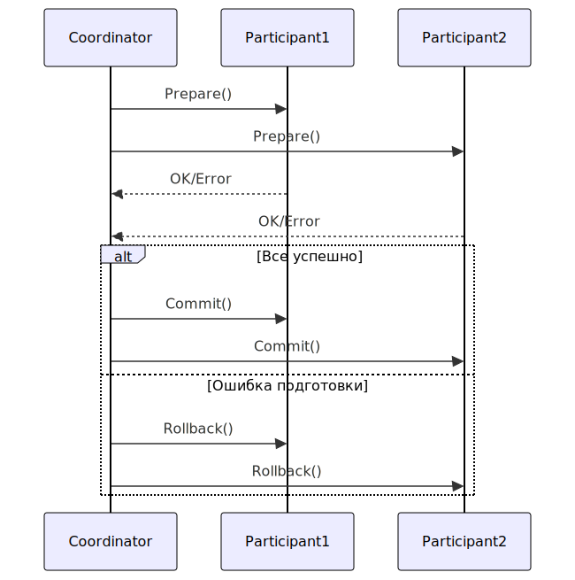

Если бы второй участник вернул false на этапе prepare, координатор вызвал бы rollbackAll(), и участник(и) выполнили бы откат.

В реальных системах роль Participant выполняют менеджеры ресурсов – например, каждая база данных умеет на запрос prepare записать свои изменения в журнал транзакций и подтвердить готовность, а на commit – завершить транзакцию. Координатор обычно реализуется в виде транзакционного менеджера (Transaction Manager) – компонент, встроенный, например, в приложение или среду исполнения.

### Ограничения и недостатки двухфазного коммита

Хотя 2PC гарантирует строгую согласованность, в распределённых системах он имеет известные недостатки:

- **Блокировка ресурсов и производительность:** На фазе подготовки каждый участник обычно блокирует изменяемые ресурсы (например, строки в базе) до получения команды commit или rollback. Если участников много, и они ждут друг друга, это может затормозить систему. В случае задержек или сбоев ожидание может быть длительным, и заблокированные ресурсы недоступны другим транзакциям – снижая параллелизм. 2PC поэтому плохо масштабируется с ростом числа участников: задержка одного узла удерживает всех.
- **Точка отказа – координатор:** Координатор транзакции – центральный “командир”. Если он выйдет из строя в неподходящий момент, участники останутся в подвешенном состоянии. Например, участники подготовились и ответили “Yes”, ждут команду, а координатор умер или потерял связь – они не знают, коммитить им или откатывать. Такая ситуация называется блокировкой (blocking) в 2PC. В базах данных участники в ожидании решения могут держать транзакцию открытой очень долго. Требуется администратор или специальный механизм восстановления координатора, чтобы решить судьбу транзакции. Существуют расширения (протокол трехфазного коммита, 3PC) для смягчения этой проблемы, но полностью без координатора 2PC не работает.
- **Оверхед на коммуникацию:** 2PC требует два раунда сетевого взаимодействия (broadcast prepare, затем broadcast commit/rollback). В условиях высокой нагрузки или сетевых задержек это добавляет значительный оверхед к каждой транзакции. Saga же, напротив, чаще работает асинхронно, и шаги могут выполняться без центральной синхронизации.
- **Слабая приспособленность к отказам связи:** Если один из участников недоступен, координатор не получит от него “готов”, и вся транзакция должна откатиться (ради консистентности жертвуем доступностью). В микросервисах, где отказ отдельного сервиса не редкость, 2PC приводит к более частым отказам всей операции по сравнению с Saga, которая могла бы дождаться восстановления сервиса и продолжить (или выполнить компенсации).
- **Сложность внедрения в микросервисах:** Применение 2PC между независимыми сервисами идёт вразрез с философией слабой связанности. Все участники должны быть “подчинены” общему координатору и протоколу. Это усложняет архитектуру – фактически получается распределённый монолит на уровне транзакций. Поэтому многие избегают 2PC в микросервисной архитектуре, предпочитая eventual consistency подходы (Saga, TCC и пр.).

Следует отметить, что 2PC остаётся полезным в ограниченных сценариях, где небольшое число участников и жёсткое требование атомарности. К примеру, финансовые операции между двумя банковскими системами могут использовать двухфазный коммит, если наличие центрального координатора приемлемо. Но во внутренней архитектуре современных веб-сервисов 2PC – редкий гость; чаще его заменяют на паттерны, обеспечивающие “логическую” атомарность, как Saga.

### Сравнение Saga и 2PC

Оба рассматриваемых подхода стремятся решить одну проблему – поддержать согласованность данных в распределённой среде, но делают это по-разному. Сведём ключевые отличия в таблицу:

| Критерий | Saga (Сага) | 2PC (двухфазный коммит) |
|----------|------------|------------------------|
| **Модель согласованности** | Конечная согласованность (eventual consistency): данные приводятся к консистентному состоянию после выполнения всех шагов. Промежуточно возможна рассинхронизация, которая исправляется компенсирующими действиями. | Строгая, мгновенная согласованность: либо все участники сразу фиксируют изменения, либо ни один (атомарность на уровне протокола). В момент завершения транзакции все данные согласованы. |
| **Тип транзакции** | Набор локальных транзакций + компенсации. Каждый сервис работает автономно, глобальная "транзакция" – это последовательность шагов. | Единая глобальная транзакция, распределённая на участников. Есть понятие начала и конца общей транзакции, охватывающей все узлы. |
| **Обработка сбоев** | Сага толерантна к частичным сбоям: при ошибке на шаге выполняются компенсирующие транзакции для отмены ранее выполненных действий. Система возвращается к предыдущему консистентному состоянию. | 2PC полагается на централизованный откат: при сбое любого участника координатор отменяет всю транзакцию (ни у кого не фиксируется). Если сбой произошёл после фазы подготовки, необходим координатор (или админ) для разрешения. |
| **Задержки и производительность** | Низкие задержки на этапах: каждый шаг – быстрый локальный коммит, сервисы могут работать асинхронно. Общий процесс может занять время (особенно если много шагов), но при нормальной работе шаги не блокируют друг друга глобально. | Высокие задержки: требуется два раунда согласования. Участники вынуждены ждать команды координатора, удерживая ресурсы. Для каждой транзакции накладные расходы на координацию, что замедляет прохождение операций. |
| **Скалируемость системы** | Высокая: Saga не требует глобальных блокировок. С ростом числа сервисов сложность процессов увеличивается, но нет общей точки, где все должны синхронизироваться одновременно (особенно при хореографии). Можно параллелить независимые саги. | Ограниченная: Большое число участников делает координацию тяжёлой – координатор становится узким местом, ресурсы блокируются. Масштабирование по числу параллельных глобальных транзакций ограничено пропускной способностью координатора и сети. |
| **Отказоустойчивость** | Без единой точки отказа: выход из строя отдельного сервиса приводит к компенсациям, но остальные сервисы могут продолжать другие задачи. Сбой оркестратора (при его наличии) требует механизма восстановления состояния саги, однако систему можно спроектировать так, чтобы сага либо дождалась восстановления сервиса, либо откатилась. | Зависимость от координатора: выход из строя координатора или потеря связи могут оставить систему в неопределённости (подготовлено, но не зафиксировано). Участники сами по себе решение принять не могут – требуется восстановить координатор. То есть отказ одного компонента (координатора) ставит под угрозу всю транзакцию. |
| **Поддержка технологиями** | На уровне приложения: Не требует специальных возможностей от БД, кроме локальных транзакций. Реализуется через код приложения, фреймворки Saga, очереди сообщений. Широко поддерживается концептуально – вендор-независимо. | На уровне инфраструктуры: Требует поддержки протокола 2PC (XA) от всех участников (СУБД, брокеров). Нужен внешний или встроенный менеджер транзакций. В Java-мире существуют готовые реализации (JTA, Atomikos, etc.), но их настройка усложняет архитектуру. Многие современные NoSQL или REST-сервисы не умеют быть участниками 2PC. |
| **Примеры случаев использования** | Сложные бизнес-процессы в e-commerce (обработка заказов, платежей, доставки), бронирование путешествий (последовательное резервирование разных услуг), где важно выполнить все шаги или откатить. Подходит, когда операции можно компенсировать. | Банковские переводы между счетами в разных системах (требуют абсолютной атомарности), распределённые транзакции в нескольких базах данных (например, распределённый SQL). Иногда применяется внутри монолитов или крупных корпоративных систем, где сильная консистентность важнее производительности. |

> (Примечание: В конкретных системах эти грани могут размываться – например, Saga можно реализовать синхронно, а 2PC – с частичной децентрализацией, но в целом отличия именно такие.)

В целом, **Saga** ориентирована на доступность и гибкость ценой временной рассинхронизации, а **2PC** – на строгую консистентность ценой усложнения координации и потенциальных задержек. Выбор зависит от требований: для большинства микросервисных сценариев Saga или схожие подходы предпочтительнее, тогда как **2PC** – для узких случаев, требующих абсолютной атомарности.

## Альтернативные подходы и паттерны

Помимо Saga и классического 2PC, существуют и другие шаблоны и техники для обеспечения согласованности распределённых транзакций. Рассмотрим наиболее известные.

### Протокол TCC (Try-Confirm-Cancel)

**TCC (Try-Confirm-Cancel)** – это протокол, напоминающий двухфазный коммит, но реализованный на уровне бизнес-логики. Идея TCC: каждая операция разбивается на две фазы – предварительное выполнение (Try) и подтверждение (Confirm) либо отмену (Cancel). По сути, это резервирование ресурсов с последующим либо подтверждением, либо откатом.

**Как работает TCC:** Представим бронирование авиабилета и отеля единым пакетом. В модели TCC шаги будут такими:

- **Try:** Сервис билетов получает запрос на бронь и предварительно резервирует место (не подтверждая окончательно продажу). Параллельно сервис отелей резервирует номер. Эти “Try” шаги выполняются для всех участвующих сервисов – они занимают необходимые ресурсы, помечая их как занятые, но транзакция пока не считается завершенной.
- **Confirm:** Если все сервисы успешно выполнили Try и готовы завершить, то отправляется команда Confirm каждому – билеты выписываются окончательно, бронь отеля подтверждается. Каждый сервис совершает окончательное изменение.
- **Cancel:** Если какой-то из Try-шагов не удался (или один из сервисов ответил, что не может выполнить), то всем сервисам, уже сделавшим Try, шлётся команда Cancel – они отменяют ранее сделанные резервирования (освобождают места, деньги не списывают и т.д.).

Таким образом, TCC достигает атомарности: либо все **Confirm** прошли, либо все зарезервированное отменилось на **Cancel**. Это очень похоже на **2PC** (Try фаза – аналог prepare, Confirm/Cancel – commit/rollback). Но отличие в том, что **решение о подтверждении принимает не центральный координатор, а бизнес-логика приложения**. TCC, по сути, – частный случай Saga, где компенсирующие действия предусмотрены как отмена резервов, и они выполняются сразу, если что-то пошло не так.

**Плюсы TCC:**

- **Быстрота выявления неуспеха:** если ресурс недоступен на этапе Try, мы сразу знаем, что всю операцию придётся Cancel, и не доводим до финального подтверждения.
- **Отсутствие долгого удержания блокировок:** ресурсы резервируются, но это скорее “мягкая блокировка” с возможностью timeout. Нет необходимости держать транзакцию открытой – каждая Try сама по себе завершена локально (в отличие от 2PC, где prepare держит блок до commit).
- **Контроль в приложении:** разработчик явно управляет Confirm/Cancel, может добавить логику (например, повторять попытки, устанавливать тайм-аут на ожидание Confirm и тогда автоматически Cancel).

**Минусы TCC:**

- **Усложнение сервисов:** Каждый сервис-участник должен предоставить три метода: Try, Confirm, Cancel. Это усложняет контракт сервиса. По сути, сервис должен уметь работать с двумя фазами подтверждения даже на уровне своей локальной логики. Например, сервис бронирования отеля: Try – держит номер X зарезервированным, Confirm – окончательно помечает как занятый оплаченный, Cancel – снимает бронь.
- **Резервы и время жизни:** Если после успешных Try что-то задерживается (например, клиент думает, подтверждать или нет), зарезервированные ресурсы не доступны другим. Нужна стратегия тайм-аутов: если Confirm не пришёл за оговоренное время, автоматически выполнять Cancel. Иначе “призраки” резервов будут висеть.
- **Обработка сбоев и повторов:** Если сервис получил Confirm, а ответ потерялся – повторный Confirm не должен приводить к ошибке (операции тоже должны быть идемпотентны). Если какой-то Cancel не дошёл, ресурс может остаться залоченным – нужны периодические проверки. То есть по сути те же проблемы, что и Saga: необходимо следить за консистентностью вручную.
- **Ограниченная применимость:** TCC удобно, когда можно сделать именно резервирование. Это типично для бронирований, оплаты (резерв средств на карте), выделения ресурсов. Но не всякую операцию можно реализовать в виде “сначала зарезервировать, потом подтвердить”. Например, отправку email или запись в лог нельзя “зарезервировать”, их придётся делать либо как Saga с компенсацией, либо игнорировать в случае отмены.

## Паттерн Outbox (Transactional Outbox)

Проблема **двойной записи (dual-write)** – одна из самых распространённых в микросервисах: как гарантировать, что действие в локальной базе данных и отправка события/сообщения в другой сервис произойдут атомарно? Например, Order Service сохранил заказ в своей БД и должен отправить событие «OrderCreated» в Kafka для других сервисов. Если запись в БД прошла, а отправка сообщения не удалась (сеть моргнула) – данные уже изменились, а другие сервисы об этом не узнают. И наоборот, если сообщение ушло, а база не сохранилась – другие узнают о заказе, которого нет. Классический 2PC между БД и брокером бывает недоступен (скажем, Kafka не поддерживает XA с вашей БД). **Паттерн Outbox** решает эту проблему, гарантируя, что база и сообщение остаются синхронизированы.

Суть паттерна **Outbox**: вместо прямой отправки сообщения, сервис сначала сохраняет информацию о нём в специальной **таблице Outbox** в своей локальной базе в **рамках той же транзакции**, что и основные данные. Затем отдельный процесс или поток читает эту таблицу и фактически отправляет сообщения внешним адресатам. Алгоритм:

1. **Локальная транзакция:** В сервис поступает запрос (например, создать заказ). Сервис открывает транзакцию к своей БД. В ней он выполняет обычные изменения (создает запись заказа) и **параллельно вставляет запись в таблицу Outbox** – например, JSON с информацией о событии «OrderCreated», которое надо отправить, и статус “новое”. Затем транзакция коммитится. Если по каким-то причинам база не сохранилась – соответственно, ни заказ, ни событие в Outbox не записались. Если коммит успешен – и заказ, и запись о сообщении надежно в базе.
2. **Отправка из Outbox:** Отдельный компонент – назовём его Outbox Processor – периодически (или по триггеру) считывает новые записи из таблицы Outbox. Для каждой записи он осуществляет реальную отправку сообщения в брокер или вызывает внешний сервис. После успешной отправки помечает запись Outbox как отправленную (или удаляет ее). Эта операция тоже транзакционная локально в базе.

В результате достигается **атомарность конечного эффекта**: либо заказ сохранён и сообщение об этом отправлено, либо если заказ не сохранился, то и сообщение не было зафиксировано (не появилось в Outbox). Даже если отправка в брокер временно невозможна, запись надёжно лежит в базе и дождётся следующей попытки. Мы устраняем ситуацию рассинхрона между БД и сообщениями.

**Преимущества Outbox-паттерна:**

- **Гарантированная доставка (at-least-once):** Сообщение не потеряется, пока транзакция БД состоялась. Если брокер недоступен, можно повторять отправку, когда он появится. Данные не потеряются – они сохранены в Outbox. Таким образом, сервисы надежно обмениваются событиями, даже при отказах отдельных компонентов.
- **Атомарность записи и оповещения:** В рамках одной локальной транзакции мы добиваемся, что изменение состояния (например, создание заказа) неотделимо от постановки события в очередь на рассылку. Получается аналог “мини-2PC” полностью внутри одной базы, что значительно проще и надёжнее.
- **Простота реализации:** Outbox не требует сложных протоколов – это просто дополнительная таблица и фоновой процесс. Многие реализуют через механизмы Change Data Capture: например, Debezium может читать транзакционный лог базы и публиковать события в Kafka, вообще без написания кода “процессора”. То есть интеграция может быть довольно тривиальной.

**Недостатки Outbox-паттерна:**

- **Необходимость хранения и обработки Outbox:** Нужно выделять место в базе под эту таблицу, чистить старые записи, следить за производительностью. В сущности, мы внедряем механизм очереди/журнала внутри сервиса – это дополнительная ответственность.
- **At-least-once семантика:** Обычно Outbox обеспечивает как минимум одно доставление сообщения. Возможны дубликаты (если процессор упал после отправки, но до отметки “отправлено” – при перезапуске он попробует отправить снова). Поэтому получатели должны быть готовы к дубликатам (делать консолидацию или игнорировать повторные события – а это опять же вопрос идемпотентности обработчиков). Достичь строгого exactly-once сложно, хотя есть техники (комбинирование с Inbox-таблицами на принимающей стороне, дедупликация по ID сообщения).
- **Задержка между основным событием и оповещением:** Отправка из Outbox может происходить не мгновенно, а с небольшой задержкой (зависит от частоты опроса или настроек CDC). Обычно это миллисекунды-секунды, что не критично, но для очень чувствительных ко времени систем может быть фактором.

Несмотря на эти минусы, Outbox-паттерн стал **де-факто стандартом** в построении надёжных асинхронных интеграций между микросервисами. Он особенно хорошо дополняет Saga: например, один сервис через Outbox публикует событие, запускающее следующий шаг Saga в другом сервисе, гарантируя, что ни один шаг не потеряется.

## Практические рекомендации: как выбрать подход

При проектировании системы из микросервисов, требующих согласованных изменений, стоит придерживаться ряда рекомендаций:

- **По возможности избегайте глобальных транзакций:** Старайтесь спроектировать сервисы и данные так, чтобы минимизировать случаи, когда одна операция обновляет несколько сервисов. Иногда можно пересмотреть границы сервисов или денормализовать данные, чтобы уложиться в локальную транзакцию. Глобальные распределённые транзакции – источник повышенной сложности.
- **Оценивайте требования к согласованности:** Не всегда нужна мгновенная консистентность. Если бизнес допускает небольшие расхождения, лучше выбрать Saga или аналогичный паттерн с eventual consistency. Строгую атомарность (2PC) оставьте для действительно критичных инвариантов. Помните: ACID в масштабах всей системы обычно жертвует доступностью и скоростью. Если система клиентская (веб-приложение), пользователи готовы принять, что статус заказа обновится через пару секунд, лишь бы само приложение работало быстро и не падало.
- **Используйте Saga для бизнес-процессов:** Saga-паттерн отлично подходит для длинных цепочек действий: оформление заказов, биллинг, рабочие процессы, где шаги четко выделены. Он требует больше кода (компенсации), но этот код явно отражает бизнес-логику обработки ошибок. Если у вас 3-5 сервисов, участвующих в одном сценарии, Saga вероятно будет удачным выбором. Начинающим архитекторам Saga более интуитивна, чем накрутка XA-транзакций.
- **Оркестрация vs хореография:** На старте проще понять и отладить оркестрацию – когда один сервис (или модуль) руководит всеми шагами. Однако следите, чтобы оркестратор не превратился в “божественный объект”, знающий про все сервисы избыточно. Хореография в больших системах помогает распределить ответственность, но будьте осторожны с "лавиной событий". Хорошая практика – документировать или визуализировать поток событий Saga-хореографии, чтобы команда разработки понимала последовательность.
- **TCC для ограниченных случаев:** Если ваш сценарий естественно раскладывается на “резерв и потвердить/отменить” – например, бронирование ресурсов, накопительные системы скидок – то TCC может быть элегантным решением. Но будьте готовы реализовать тайм-ауты и очистку резервов. TCC особенно полезен, когда нужно гарантировать отсутствие компенсирующих операций, то есть вообще не доводить дело до реального изменения, если что-то не получилось у другого сервиса.
- **Избегайте чрезмерного 2PC:** Запуск 2PC между микросервисами оправдан крайне редко. Например, если у вас две критически связанные базы (скажем, бухгалтерия и склад должны меняться синхронно и у вас есть готовая инфраструктура для XA) – тогда да. Но во всех остальных случаях старайтесь решить вопрос либо на уровне приложения (Saga/TCC), либо через архитектурные изменения. Опыт показывает, что системы, сильно завязанные на 2PC, трудно масштабировать и поддерживать.
- **Паттерн Outbox – “must have” для коммуникации через брокеры:** Практически всегда, когда микросервисы обмениваются событиями или командами, стоит применять Outbox (или аналогичный подход, например, транзакционные publish-confirm механизмы). Это значительно повышает надежность межсервисного взаимодействия. Если не хотите писать собственный Outbox-процессор, рассмотрите готовые решения на базе Debezium (CDC) или библиотек (в мире .NET, Java есть реализации). Но не пренебрегайте проблемой двойной записи – она очень коварна и легко возникает, когда сервисы общаются.
- **Idempotency everywhere:** Гарантируйте идемпотентность критических действий. Будь то Saga или TCC, или потребитель Outbox-сообщений – дубликаты и повторные вызовы возможны. Используйте уникальные идентификаторы операций, статусные флаги (“уже обработано”) или механизмы deduplication. Проще заложить это сразу, чем потом устранять баги “двойного списания денег”.
- **Логирование и трассировка:** Внедрите корреляционный идентификатор для связанных действий – будь то ID саги, транзакции или заказа. Передавайте его через заголовки сообщений, логи и пр. Современные мониторинговые системы (Jaeger, Zipkin, etc.) помогут видеть “цепочку” запросов между микросервисами – настройте их на этапах разработки. Это спасет много времени при отладке распределённых транзакций.
- **Ограничивайте время выполнения глобальных операций:** Если у вас саги или TCC, которые могут длиться долго (например, пользователь заполняет что-то или ждет внешнего ответа), ставьте разумные сроки жизни. “Зависшие” процессы занимают ресурсы и могут запутать данные. Например, если Saga не может завершиться из-за постоянных проблем – возможно, стоит отменить её и инициировать компенсации спустя некоторое время (fallback strategy).
- **Документируйте согласованность в API контракте:** Если ваш сервис по внешнему API запускает асинхронную операцию (например, Saga), четко опишите, что ответ клиенту может прийти раньше, чем все подсистемы знают о результате. Хороший пример – оплата: сразу отвечаем “платёж обрабатывается”, а окончательный статус придёт позже. Клиентская сторона должна понимать, что данные станут окончательными через некоторое время.


## Разрабатываем микросервисную архитектуру: обзор


```graph
graph TD
    A[Client] --> B[Order Service]
    B --> C[Catalog Service]
    B --> D[Payment Service]
```

### Диаграмма последовательности SAGA

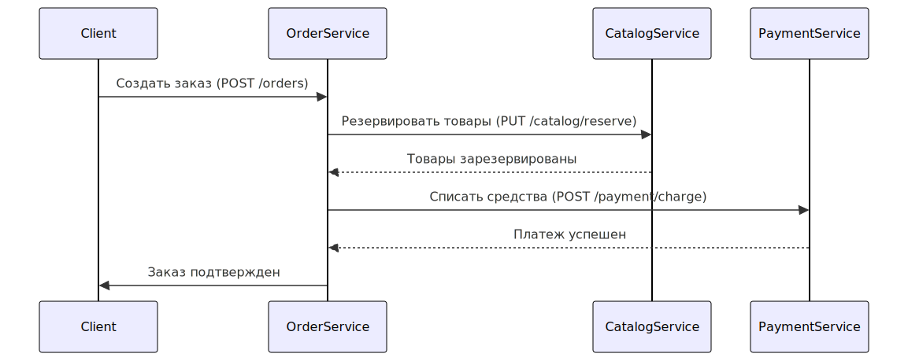

```sequence
sequenceDiagram
    participant Client
    participant OrderService
    participant CatalogService
    participant PaymentService

    Client->>OrderService: Создать заказ (POST /orders)
    OrderService->>CatalogService: Резервировать товары (PUT /catalog/reserve)
    CatalogService-->>OrderService: Товары зарезервированы
    OrderService->>PaymentService: Списать средства (POST /payment/charge)
    PaymentService-->>OrderService: Платеж успешен
    OrderService->>Client: Заказ подтвержден
```

### Критические компоненты

#### Order Service

Роль: Оркестратор SAGA, управляет процессом заказа.

**Пример кода:**

```go
func (s *OrderService) CreateOrder() error {
    // 1. Резервируем товары
    if err := s.catalog.ReserveItems(); err != nil {
        return err
    }
    
    // 2. Списываем средства
    if err := s.payment.Charge(); err != nil {
        s.catalog.CancelReservation() // Компенсационная транзакция
        return err
    }
    
    return nil
}
```

#### Catalog Service

Роль: Управляет остатками товаров.

#### Payment Service

Роль: Обрабатывает платежи.

#### Диаграмма последовательнсти

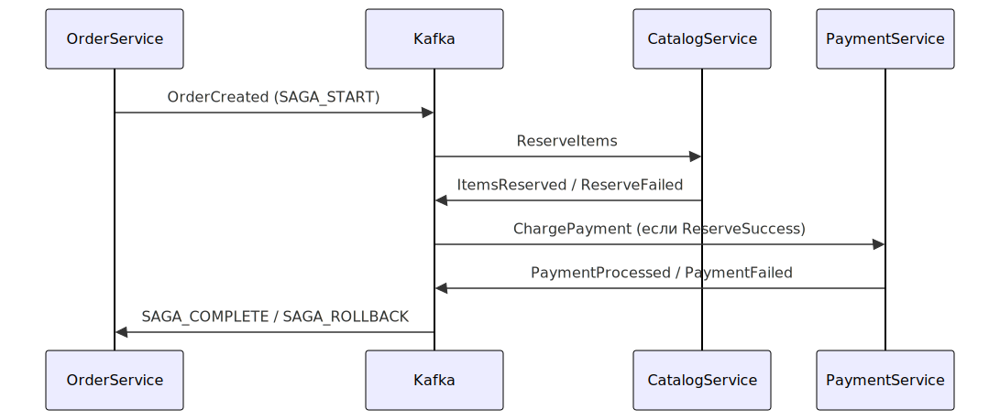

```sequence
sequenceDiagram
    participant OrderService
    participant Kafka
    participant CatalogService
    participant PaymentService

    OrderService->>Kafka: OrderCreated (SAGA_START)
    Kafka->>CatalogService: ReserveItems
    CatalogService->>Kafka: ItemsReserved / ReserveFailed
    Kafka->>PaymentService: ChargePayment (если ReserveSuccess)
    PaymentService->>Kafka: PaymentProcessed / PaymentFailed
    Kafka->>OrderService: SAGA_COMPLETE / SAGA_ROLLBACK
```

## Проблемы базовой реализации:

- Нет защиты от **повторных запросов**
- **Каскадные ошибки** при недоступности сервисов
- **Потеря событий** при сбоях
- **Отсутствие истории** изменений

### Что можно улучшить

- Добавить Idempotency Key для избежания дублирования операций.
- Внедрить Circuit Breaker для устойчивости к ошибкам.
- Использовать Outbox Pattern для надежной доставки событий.

### Вывод

- ✅ SAGA решает проблему распределенных транзакций
- ✅ Каждый сервис управляет своей частью данных
- ✅ Компенсационные транзакции обеспечивают согласованность
- ⚠ Не подходит для высоконагруженных систем (лучше Event Sourcing + CQRS)

### Глосарий

> ##### Компенсационные транзакции (SAGA Rollback)
> Если на любом этапе происходит ошибка, система выполняет обратные операции в обратном порядке:
> 1. **Платеж не прошел** → Отмена резерва товаров (CatalogService.CancelReservation).
> 2. **Резерв не удался** → Заказ отклоняется без списания денег.


## Улучшенная Event-Driven SAGA


```graph
graph LR
    A[Order] -->|Events| B[Kafka]
    B --> C[Catalog]
    B --> D[Payment]
    C --> B
    D --> B
```

> Можно реализовать через Kafka или RabbitMQ:

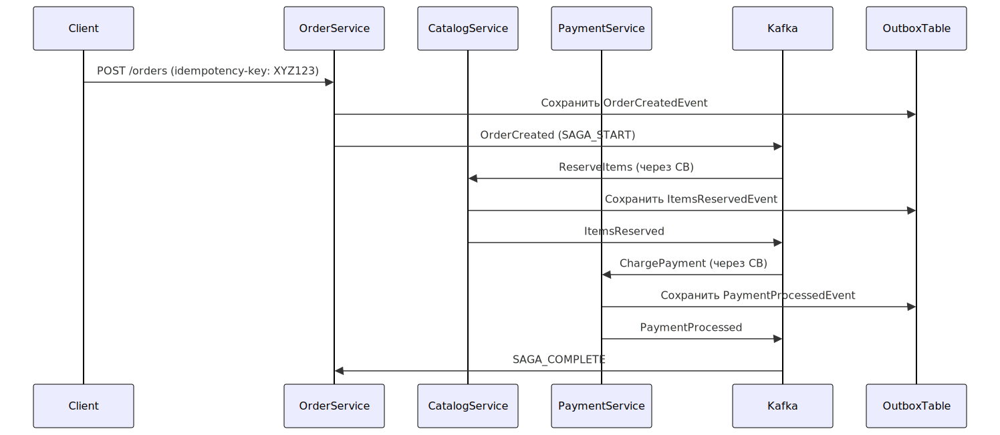

```sequence
sequenceDiagram
    participant Client
    participant OrderService
    participant CatalogService
    participant PaymentService
    participant Kafka
    participant OutboxTable

    Client->>OrderService: POST /orders (idempotency-key: XYZ123)
    OrderService->>OutboxTable: Сохранить OrderCreatedEvent
    OrderService->>Kafka: OrderCreated (SAGA_START)
    Kafka->>CatalogService: ReserveItems (через CB)
    CatalogService->>OutboxTable: Сохранить ItemsReservedEvent
    CatalogService->>Kafka: ItemsReserved
    Kafka->>PaymentService: ChargePayment (через CB)
    PaymentService->>OutboxTable: Сохранить PaymentProcessedEvent
    PaymentService->>Kafka: PaymentProcessed
    Kafka->>OrderService: SAGA_COMPLETE
```

### Idempotency Key (Идемпотентность)

**Задача:** Предотвращение дублирования операций при повторных запросах.
**Пример кода:**

```go
// Middleware для проверки ключа идемпотентности
func IdempotencyMiddleware(next http.Handler) http.Handler {
    return http.HandlerFunc(func(w http.ResponseWriter, r *http.Request) {
        key := r.Header.Get("Idempotency-Key")
        if cached := cache.Get(key); cached != nil {
            respondWithCached(w, cached)
            return
        }
        next.ServeHTTP(w, r)
    })
}
```

### Circuit Breaker (Автоматический переключатель)

**Задача:** Защита от каскадных ошибок при недоступности сервисов.
**Пример кода:**

```go
// Настройка для Catalog Service
cb := gobreaker.NewCircuitBreaker(gobreaker.Settings{
    Name:    "CatalogService",
    Timeout: 30 * time.Second,
    ReadyToTrip: func(counts gobreaker.Counts) bool {
        return counts.ConsecutiveFailures > 5
    },
})
```

### Outbox Pattern (Надежная доставка событий)

**Задача:** Гарантированная доставка событий даже при падении сервиса.
**Пример кода:**

```go
CREATE TABLE outbox (
    id UUID PRIMARY KEY,
    saga_id VARCHAR(255),
    event_type VARCHAR(100),
    payload JSONB,
    created_at TIMESTAMP,
    processed BOOLEAN DEFAULT false
);
```

### Архитектурная диаграмма


```graph
graph TD
    A[Client] --> B[Order Service]
    B --> C[Catalog Service]
    B --> D[Payment Service]
    B --> E[(Outbox DB)]
    C --> F[(Catalog DB)]
    D --> G[(Payment DB)]
    B --> H[Kafka]
    C --> H
    D --> H
    H --> I[SAGA Orchestrator]
    I --> B
```

### Диаграмма последовательнсти

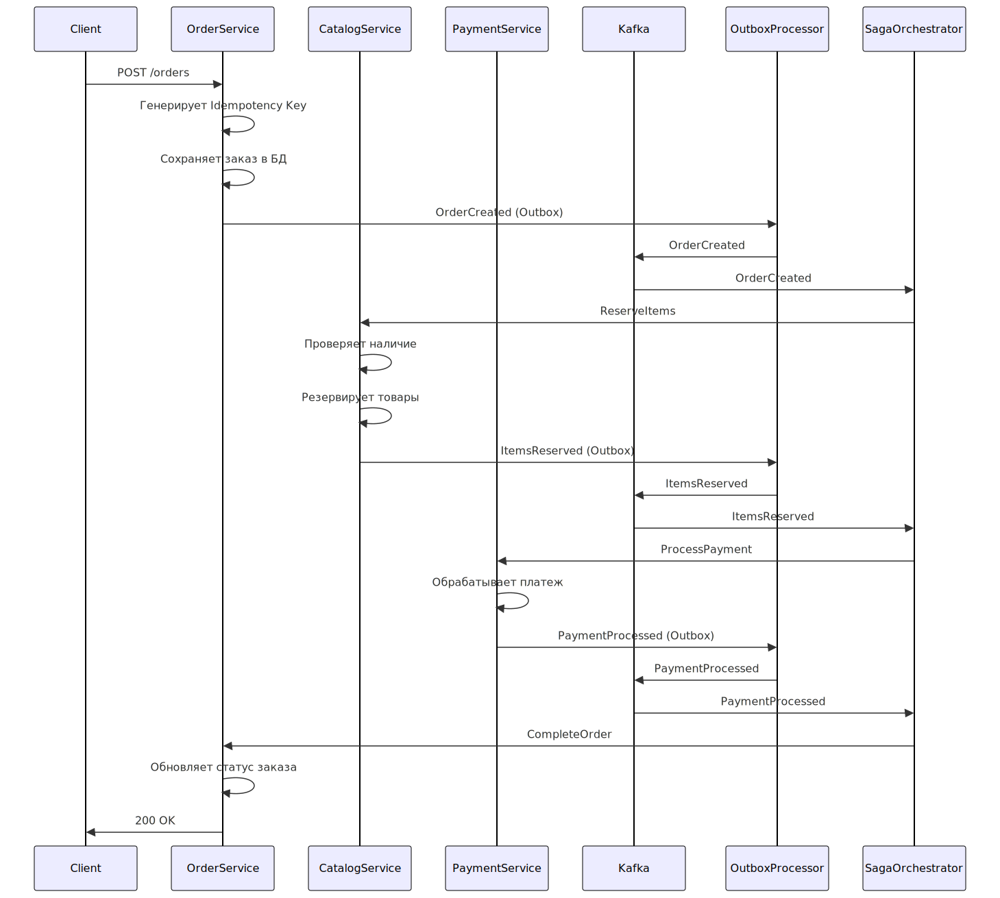

```sequence
sequenceDiagram
    participant Client
    participant OrderService
    participant CatalogService
    participant PaymentService
    participant Kafka
    participant OutboxProcessor

    Client->>OrderService: POST /orders
    OrderService->>OrderService: Генерирует Idempotency Key
    OrderService->>OrderService: Сохраняет заказ в БД
    OrderService->>OutboxProcessor: OrderCreated (Outbox)
    OutboxProcessor->>Kafka: OrderCreated
    Kafka->>SagaOrchestrator: OrderCreated
    SagaOrchestrator->>CatalogService: ReserveItems
    CatalogService->>CatalogService: Проверяет наличие
    CatalogService->>CatalogService: Резервирует товары
    CatalogService->>OutboxProcessor: ItemsReserved (Outbox)
    OutboxProcessor->>Kafka: ItemsReserved
    Kafka->>SagaOrchestrator: ItemsReserved
    SagaOrchestrator->>PaymentService: ProcessPayment
    PaymentService->>PaymentService: Обрабатывает платеж
    PaymentService->>OutboxProcessor: PaymentProcessed (Outbox)
    OutboxProcessor->>Kafka: PaymentProcessed
    Kafka->>SagaOrchestrator: PaymentProcessed
    SagaOrchestrator->>OrderService: CompleteOrder
    OrderService->>OrderService: Обновляет статус заказа
    OrderService->>Client: 200 OK
```

## 📊 Сравнение подходов

| Подход              | Достоинства | Недостатки  |
|---------------------|---|---|
| **Базовая SAGA**    | Простота реализации  | Нет защиты от дублирования  |
| **С оптимизациями** | Отказоустойчивость, надежность | Сложность возрастает  |

## Переход к CQRS и Event Sourcing

### CQRS: разделение ответственности

**Архитектура:**


```graph
graph TB
    A[Command] --> B[Command Handler]
    B --> C[Event Store]
    C --> D[Read Model]
    E[Query] --> F[Read Model]
```

**Пример кода:**

```go
package main

// Command Side
type CreateOrderCommand struct {
    UserID uuid.UUID
    Items  []OrderItem
}

type OrderCommandHandler struct {
    eventStore EventStore
}

func (h *OrderCommandHandler) Handle(cmd CreateOrderCommand) error {
    events := []Event{
        NewEvent("OrderCreated", cmd),
    }
    return h.eventStore.Append(events)
}

// Query Side
type OrderReadModel struct {
    db *sql.DB
}

func (r *OrderReadModel) GetByID(id uuid.UUID) (OrderView, error) {
    // Query from optimized read storage
}
```

### Глосарий

> Принцип разделения: 
> 
> **Commands** - изменение состояния
> 
> **Queries** - чтение данных

Queries - чтение данных

## Event Sourcing: принципиально новый подход

### Основная концепция

**Состояние системы** = Последовательность событий

```go
type EventStore interface {
    Append(event Event) error
    GetStream(aggregateID string) ([]Event, error)
}

type Event struct {
    ID          uuid.UUID
    Type        string
    AggregateID string
    Data        []byte
    Version     uint64
    Timestamp   time.Time
}
```

### Реализация агрегата

```go
type OrderAggregate struct {
    ID      uuid.UUID
    Version uint64
    State   OrderState
}

func (a *OrderAggregate) Apply(event Event) error {
    switch event.Type {
    case "OrderCreated":
        var data OrderCreatedData
        json.Unmarshal(event.Data, &data)
        a.State = OrderState{Status: "created"}
    case "PaymentProcessed":
        a.State.Status = "paid"
    }
    a.Version = event.Version
    return nil
}
```

## Комбинированный подход: Event Sourcing + CQRS

### Полная архитектура


```graph
graph LR
    A[Client] --> B[Command]
    B --> C[Command Handler]
    C --> D[Event Store]
    D --> E[Event Processor]
    E --> F[Read Model]
    A --> G[Query]
    G --> F
    E --> H[Projections]
    H --> I[Analytics DB]
```

### Пример кода

```go
package main

// todo
```

### Диаграмма последовательности

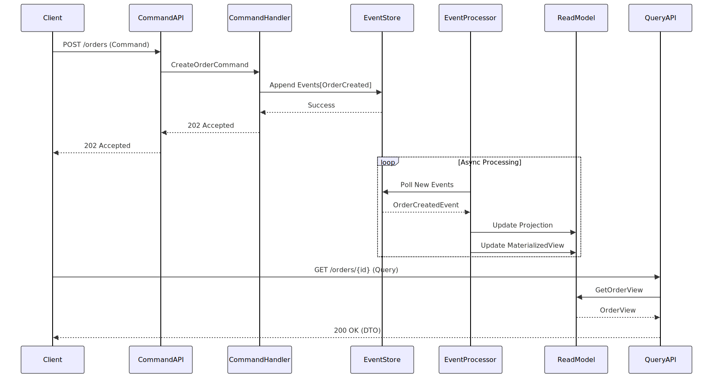

```sequence
sequenceDiagram
    participant Client
    participant CommandAPI
    participant CommandHandler
    participant EventStore
    participant EventProcessor
    participant ReadModel
    participant QueryAPI

    Client->>CommandAPI: POST /orders (Command)
    CommandAPI->>CommandHandler: CreateOrderCommand
    CommandHandler->>EventStore: Append Events[OrderCreated]
    EventStore-->>CommandHandler: Success
    CommandHandler-->>CommandAPI: 202 Accepted
    CommandAPI-->>Client: 202 Accepted

    loop Async Processing
        EventProcessor->>EventStore: Poll New Events
        EventStore-->>EventProcessor: OrderCreatedEvent
        EventProcessor->>ReadModel: Update Projection
        EventProcessor->>ReadModel: Update MaterializedView
    end

    Client->>QueryAPI: GET /orders/{id} (Query)
    QueryAPI->>ReadModel: GetOrderView
    ReadModel-->>QueryAPI: OrderView
    QueryAPI-->>Client: 200 OK (DTO)
```

### Текстовая версия диаграммы:

> 1. Клиент отправляет команду:
>
>    `Client → CommandAPI: POST /orders {items: [...]}`
> 2. Command API перенаправляет команду обработчику:
>
>    `CommandAPI → CommandHandler: CreateOrderCommand`
> 3. Обработчик сохраняет события:
>
>    `CommandHandler → EventStore: Append [OrderCreatedEvent]`
> 4. EventStore подтверждает запись:
>
>    `EventStore → CommandHandler: Success`
> 5. Клиент получает подтверждение:
>
>    `CommandHandler → CommandAPI → Client: 202 Accepted`
> 6. Фоновый процесс обработки событий:
>    - **EventProcessor** периодически опрашивает **EventStore**
>    - Получает новые события (`OrderCreatedEvent`)
>    - Обновляет проекции в **ReadModel**
> 7. Клиент запрашивает данные:
>
>    `Client → QueryAPI: GET /orders/123`
> 8. Query API получает данные из ReadModel:
>
>    `QueryAPI → ReadModel: GetOrderView(123)`
> 9. Данные возвращаются клиенту:
>
>    `ReadModel → QueryAPI → Client: OrderViewDTO`

### Ключевые особенности потока:

1. **Разделение путей записи и чтения:**
    - Запись идет через Command Stack (левая часть)
    - Чтение через Query Stack (правая часть)

2. **Асинхронная обработка:**
    - Обновление ReadModel происходит после фиксации событий
    - Задержка между записью и консистентностью чтения (Eventual Consistency)
3. **Компоненты:**
    - `EventStore` - хранилище событий (например, Kafka+PostgreSQL)
    - `EventProcessor` - подписчик на события (Consumer)
    - `ReadModel` - оптимизированное хранилище для чтения (MongoDB/Elasticsearch)

### Типовые задержки:

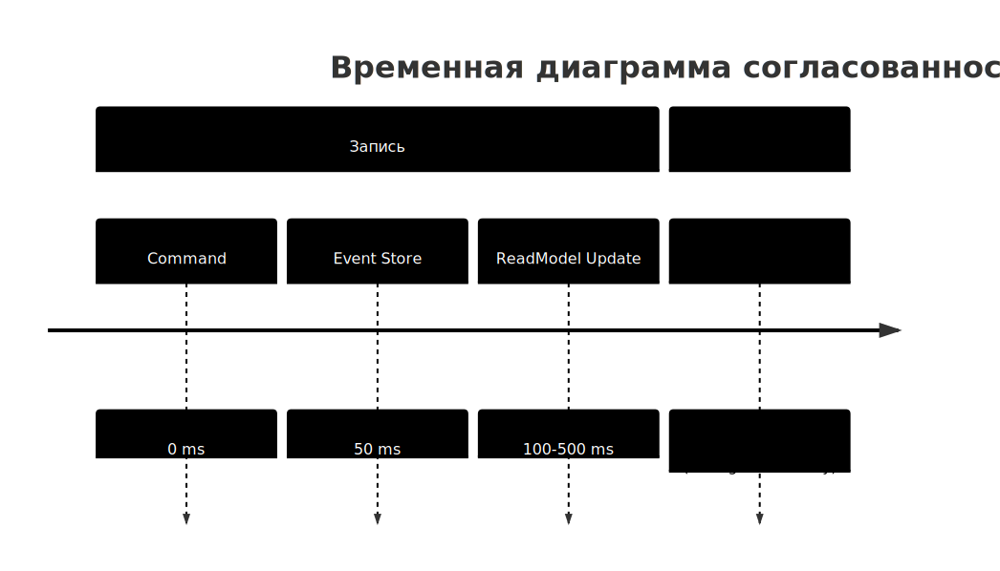

```timeline
timeline
    title Временная диаграмма согласованности
    section Запись
    Command : 0 ms
    Event Store : 50 ms
    ReadModel Update : 100-500 ms
    section Чтение
    Query : После 500 ms (strong consistency)
```

## Сравнительный анализ

| Критерий               | SAGA                | Event Sourcing      | CQRS                | ES+CQRS             |
|------------------------|---------------------|---------------------|---------------------|---------------------|
| **Сложность**          | Низкая              | Высокая             | Средняя             | Очень высокая       |
| **Производительность** |                     |                     |                     |                     |
| - Запись               | Средняя             | Низкая              | Средняя             | Средняя             |
| - Чтение               | Средняя             | Низкая              | Очень высокая       | Оптимальная         |
| **Масштабируемость**   | Ограничена          | Отличная            | Отличная            | Наилучшая           |
| **Гибкость**           | Ограничена          | Максимальная        | Высокая             | Максимальная        |
| **История изменений**  | Нет                 | Полная              | Частичная           | Полная              |
| **Согласованность**    | Eventual            | Strong              | Strong              | Strong              |
| **Латентность**        | Низкая              | Высокая             | Низкая (чтение)     | Средняя             |
| **Объем кода**         | Минимальный         | Большой             | Умеренный           | Максимальный        |
| **Использование**      | Простые workflows   | Аудит/аналитика     | Отчеты              | Комплексные системы |

## Рекомендации по внедрению

1. Стартапы: SAGA + Circuit Breaker
2. Средние проекты: Добавить Event Sourcing для ключевых агрегатов
3. Сложные системы: Полный ES+CQRS с оптимизированными проекциями


```graph
graph TD
    A[Выбор архитектуры] --> B{Критична ли полная история?}
    B -->|Да| C{Требуется ли высокая производительность чтения?}
    C -->|Да| D[ES+CQRS]
    C -->|Нет| E[Чистый Event Sourcing]
    B -->|Нет| F[Оптимизированная SAGA]
```

## Заключение

Эволюция архитектуры требует постепенного усложнения:

1. Начните с **SAGA** для базовой согласованности
2. Добавьте **Event Sourcing** для ключевых доменов
3. Внедрите **CQRS** для проблемных запросов
4. Комбинируйте **ES+CQRS** в сложных системах

> **Главный принцип:** Выбирайте архитектуру, соответствующую вашим реальным потребностям, а не трендам.